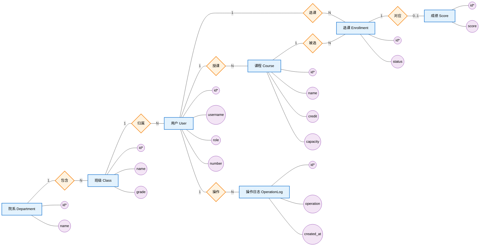
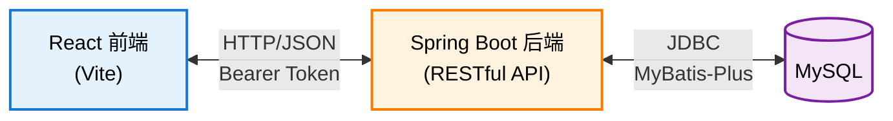

# 学生信息管理系统 — 需求文档

## 一、概述

### 1.1 项目背景

随着高校在校学生数量及开课规模的不断增长，传统的纸质或单机式学生信息维护方式已无法满足"多角色协同、数据实时共享、权限分级"的管理需求。学校管理人员需要一个能集中维护学生档案、组织院系/班级/课程结构、支持选课与成绩录入的统一平台；教师需要查看自己所授课程的选课名单并录入成绩；学生需要在线选课、退课并查询自己的成绩。

本系统即为满足上述场景而设计的 **B/S 架构学生信息管理平台**，采用前后端分离的方式实现，后端提供 RESTful API，前端通过浏览器访问。

### 1.2 项目目标

- 提供 **管理员、教师、学生** 三类角色的差异化操作入口
- 支持 **用户管理、院系管理、班级管理、课程管理、选课管理、成绩管理** 等核心业务
- 通过 JWT + Spring Security 实现 **无状态认证 + 方法级权限控制**
- 通过 AOP 自动记录所有写操作，形成 **可审计的操作日志**
- 通过 Flyway 实现 **数据库版本化迁移**，并在所有主表上启用 **软删除**

### 1.3 编写目的

本文档面向以下读者：

| 读者     | 关注重点                                   |
| -------- | ------------------------------------------ |
| 项目评审 | 系统是否覆盖学生信息管理的核心业务         |
| 开发人员 | 数据模型、字段约束、接口范围、权限边界     |
| 测试人员 | 业务规则、边界条件、用例覆盖               |
| 运维人员 | 部署形态、外部依赖（MySQL / JDK / Node）   |

### 1.4 术语与缩略语

| 术语        | 含义                                                                 |
| ----------- | -------------------------------------------------------------------- |
| 用户 (User) | 系统中可登录的账号，包含管理员、教师、学生三种角色                   |
| 院系        | 学院 / 系，是班级的上层组织                                          |
| 班级        | 隶属于某个院系，是学生的归属单位                                     |
| 课程        | 由教师开设、学生选修的教学单元，含学分与容量                         |
| 选课        | 学生与课程之间的多对多关联，状态包括"已选 (ENROLLED)"等              |
| 成绩        | 一次选课记录对应的分数（0–100，保留两位小数）                        |
| 软删除      | 数据行不被物理删除，仅置 `deleted = 1`，查询时自动过滤                |
| JWT         | JSON Web Token，无状态登录凭证                                       |
| DTO         | Data Transfer Object，承担参数校验与传输的对象                       |

---

## 二、需求分析

### 2.1 系统需求

系统需要覆盖一个高校在学生信息维度上的完整生命周期，涵盖以下五条主线：

1. **账号生命周期** — 学生 / 教师注册、登录、信息维护、禁用、（软）删除
2. **组织结构维护** — 院系、班级的增删改查；学生归属到班级，班级归属到院系
3. **教学资源维护** — 课程的开设与维护，授课教师指派
4. **选课业务** — 学生在容量范围内选课 / 退课，教师查看自己课程的选课名单
5. **成绩业务** — 教师按课程录入或修改成绩，学生查询本人成绩，管理员查看全部成绩

### 2.2 功能性需求

#### 2.2.1 基本功能列表

| 编号 | 模块       | 功能说明                                                              |
| ---- | ---------- | --------------------------------------------------------------------- |
| F-01 | 认证授权   | 登录获取 JWT、注册（默认学生角色）、修改密码                           |
| F-02 | 用户管理   | 管理员对用户进行增删改查；多条件分页查询；账号启停                     |
| F-03 | 院系管理   | 院系的增删改查                                                         |
| F-04 | 班级管理   | 班级的增删改查；级联院系                                               |
| F-05 | 课程管理   | 课程的增删改查；指派授课教师；设置学分与容量                           |
| F-06 | 选课管理   | 学生选课 / 退课；防重复选课；容量校验；教师查看选课名单                 |
| F-07 | 成绩管理   | 教师按课程录入与修改学生成绩；学生查询自己成绩；管理员查询全部成绩     |
| F-08 | 个人中心   | 用户查看与编辑自己的基本信息、修改密码                                 |
| F-09 | 数据看板   | 管理员首页展示用户数、班级数、院系数等聚合统计                          |
| F-10 | 操作日志   | 所有写操作通过 AOP 自动落库，管理员可分页查看                           |

#### 2.2.2 关键业务规则

- 用户名 `username`、学工号 `number` 全局唯一
- 学生选课：同一学生不能重复选同一门课；课程已选人数不得超过 `capacity`
- 成绩：一条选课记录最多对应一条成绩；分数范围 [0.00, 100.00]
- 删除：用户、课程、班级、院系均为软删除，删除后该行不再出现在列表/查询中
- 班级删除前应保证不再有学生归属（业务层校验）；院系删除前应保证不再有班级归属
- 操作日志只记录 **写操作**（POST / PUT / DELETE），不记录读操作

### 2.3 非功能性需求

| 类别       | 要求                                                                                  |
| ---------- | ------------------------------------------------------------------------------------- |
| 性能       | 列表接口分页；后端在常规查询下单次响应 < 500ms                                        |
| 安全       | 密码 BCrypt 加密；接口需要 JWT 认证；方法级权限控制；CORS 白名单；密码字段不回传前端 |
| 可维护性   | DTO 与实体解耦；统一响应格式 `RequestResult<T>`；全局异常处理                          |
| 可演进性   | 表结构通过 Flyway 版本化（V1__init.sql、V2__add_deleted_column.sql …）                  |
| 可审计性   | AOP 切面 + 自定义注解，所有写操作自动落操作日志                                        |
| 可部署性   | 提供 `docker compose up -d` 一键部署；本地开发可独立启动前后端                         |
| 兼容性     | 前端兼容主流浏览器（Chrome / Edge / Firefox 最近两个大版本）                          |

### 2.4 角色与权限

系统定义三种角色：`ROLE_ADMIN`、`ROLE_TEACHER`、`ROLE_STUDENT`。

| 功能模块     | 管理员            | 教师                  | 学生              |
| ------------ | ----------------- | --------------------- | ----------------- |
| 用户管理     | 增 / 删 / 改 / 查 | 只读                  | —                 |
| 院系管理     | 增 / 删 / 改 / 查 | 只读                  | —                 |
| 班级管理     | 增 / 删 / 改 / 查 | 只读                  | —                 |
| 课程管理     | 增 / 删 / 改 / 查 | 增 / 删 / 改 / 查     | —                 |
| 选课管理     | —                 | 查看自己课程的选课名单 | 选课 / 退课       |
| 成绩管理     | 录入 / 修改 / 查询全部 | 录入 / 修改自己课程 | 查询自己成绩      |
| 个人信息     | 查看 / 修改       | 查看 / 修改           | 查看 / 修改       |
| 数据统计看板 | 查看              | —                     | —                 |
| 操作日志     | 查看              | —                     | —                 |

权限通过 `@PreAuthorize("hasAuthority('ROLE_XXX')")` 在 Controller 方法上声明，未通过时由全局异常处理器返回 `权限不足`。

### 2.5 主要用例

#### 2.5.1 学生选课用例

- **前置条件**：学生已登录，存在可选课程
- **主流程**：
  1. 学生进入"课程列表"页面
  2. 系统返回所有未删除课程及其当前已选人数
  3. 学生点击"选课"
  4. 后端校验：① 课程存在；② 该学生未选过该课程；③ 已选人数 < capacity
  5. 校验通过则插入 `my_enrollment` 记录，状态置为 `ENROLLED`
- **异常分支**：重复选课 / 容量已满 → 返回友好提示，不写入

#### 2.5.2 教师录入成绩用例

- **前置条件**：教师已登录，且课程的 `teacher_id` 等于当前用户 ID
- **主流程**：
  1. 教师选择某门自己开设的课程
  2. 系统返回该课程下所有 `ENROLLED` 状态的选课名单
  3. 教师为每位学生填写分数并提交
  4. 后端按 `enrollment_id` 维度 upsert 到 `my_score`
- **异常分支**：分数越界 / 选课记录不存在 → 返回校验错误

#### 2.5.3 管理员维护用户用例

- **前置条件**：管理员已登录
- **主流程**：分页 + 多条件筛选（用户名、角色、学号、班级、性别、手机号、状态）→ 增 / 改 / 软删除
- **副作用**：所有写操作触发 AOP 切面，记录到 `my_operation_log`

---

## 三、数据库设计

### 3.1 概念设计 — E-R 图

下图采用 **Chen 记号** 绘制：矩形 = 实体，菱形 = 联系，椭圆 = 属性，连线上的 `1 / N / M / 0..1` 表示基数；带 `*` 的属性为主键。完整属性列表见 [3.2 关系模式](#32-关系模式逻辑设计)。

> 说明：
> - `User` 表通过 `role` 字段同时承担"管理员 / 教师 / 学生"三种身份；
> - "教师授课"是 `User` → `Course` 的一对多联系（`Course.teacher_id`）；
> - "学生选课"原本是 `User` ↔ `Course` 的 M:N 联系，已用 **关联实体** `Enrollment` 拆分为两个 1:N 联系（选课 / 被选）；
> - 一条选课记录最多对应一条成绩，故 `Enrollment` ↔ `Score` 为 1:0..1。

### 3.2 关系模式（逻辑设计）

将上节 E-R 图转化为关系模式（下划线表示主键，斜体表示外键）：

- USER(<u>id</u>, username, password, role, number, *class_id*, gender, phone_number, status, deleted)
- DEPARTMENT(<u>id</u>, name, description, deleted)
- CLASS(<u>id</u>, *department_id*, name, grade, deleted)
- COURSE(<u>id</u>, name, credit, *teacher_id*, capacity, description, deleted)
- ENROLLMENT(<u>id</u>, *student_id*, *course_id*, status)
- SCORE(<u>id</u>, *enrollment_id*, score)
- OPERATION_LOG(<u>id</u>, username, operation, method, params, ip, created_at)

外键关系（应用层维护，库级未强制约束以方便软删除）：

| 子表       | 子表字段       | 父表       | 父表字段 |
| ---------- | -------------- | ---------- | -------- |
| CLASS      | department_id  | DEPARTMENT | id       |
| USER       | class_id       | CLASS      | id       |
| COURSE     | teacher_id     | USER       | id       |
| ENROLLMENT | student_id     | USER       | id       |
| ENROLLMENT | course_id      | COURSE     | id       |
| SCORE      | enrollment_id  | ENROLLMENT | id       |

### 3.3 数据字典

#### 3.3.1 用户表 `my_user`

| 字段名       | 数据类型     | 约束                          | 说明                                |
| ------------ | ------------ | ----------------------------- | ----------------------------------- |
| id           | BIGINT       | PK, AUTO_INCREMENT            | 主键                                 |
| username     | VARCHAR(100) | UNIQUE, NOT NULL              | 登录用户名                           |
| password     | VARCHAR(255) | NOT NULL                      | BCrypt 加密后的密码，序列化时不回传 |
| role         | VARCHAR(20)  | DEFAULT `'ROLE_STUDENT'`      | `ROLE_ADMIN` / `ROLE_TEACHER` / `ROLE_STUDENT` |
| status       | TINYINT      | DEFAULT 1                     | 1 启用 / 0 禁用                      |
| number       | VARCHAR(50)  | UNIQUE                        | 学号或工号                           |
| class_id     | BIGINT       |                               | 所属班级（仅学生需要）               |
| gender       | VARCHAR(50)  | DEFAULT `'MAN'`               | `MAN` / `WOMAN`                      |
| phone_number | VARCHAR(20)  |                               | 手机号                               |
| deleted      | TINYINT      | NOT NULL DEFAULT 0            | 软删除标记                           |

#### 3.3.2 院系表 `my_department`

| 字段名      | 数据类型     | 约束                | 说明     |
| ----------- | ------------ | ------------------- | -------- |
| id          | BIGINT       | PK, AUTO_INCREMENT  | 主键     |
| name        | VARCHAR(100) | NOT NULL            | 院系名称 |
| description | VARCHAR(100) | NOT NULL            | 简介     |
| deleted     | TINYINT      | NOT NULL DEFAULT 0  | 软删除   |

#### 3.3.3 班级表 `my_class`

| 字段名        | 数据类型     | 约束                | 说明     |
| ------------- | ------------ | ------------------- | -------- |
| id            | BIGINT       | PK, AUTO_INCREMENT  | 主键     |
| department_id | BIGINT       | NOT NULL            | 所属院系 |
| name          | VARCHAR(100) | NOT NULL            | 班级名称 |
| grade         | INT          | NOT NULL            | 年级     |
| deleted       | TINYINT      | NOT NULL DEFAULT 0  | 软删除   |

#### 3.3.4 课程表 `my_course`

| 字段名      | 数据类型     | 约束                                | 说明     |
| ----------- | ------------ | ----------------------------------- | -------- |
| id          | BIGINT       | PK, AUTO_INCREMENT                  | 主键     |
| name        | VARCHAR(100) | NOT NULL DEFAULT `'默认课程'`        | 课程名   |
| credit      | INT          | NOT NULL DEFAULT 1，校验范围 [1, 8] | 学分     |
| teacher_id  | BIGINT       | NOT NULL                            | 授课教师 |
| capacity    | INT          | NOT NULL DEFAULT 50，校验范围 [1, 100] | 容量  |
| description | VARCHAR(200) |                                     | 课程简介 |
| deleted     | TINYINT      | NOT NULL DEFAULT 0                  | 软删除   |

#### 3.3.5 选课表 `my_enrollment`

| 字段名     | 数据类型     | 约束                              | 说明                          |
| ---------- | ------------ | --------------------------------- | ----------------------------- |
| id         | BIGINT       | PK, AUTO_INCREMENT                | 主键                          |
| student_id | BIGINT       | NOT NULL                          | 学生 ID                       |
| course_id  | BIGINT       | NOT NULL                          | 课程 ID                       |
| status     | VARCHAR(100) | NOT NULL DEFAULT `'ENROLLED'`     | 选课状态枚举                  |

> 业务约束：`(student_id, course_id)` 在未删除范围内应唯一。

#### 3.3.6 成绩表 `my_score`

| 字段名        | 数据类型      | 约束                      | 说明                           |
| ------------- | ------------- | ------------------------- | ------------------------------ |
| id            | BIGINT        | PK, AUTO_INCREMENT        | 主键                           |
| enrollment_id | BIGINT        | NOT NULL                  | 关联的选课记录                 |
| score         | DECIMAL(5, 2) | NOT NULL，校验 [0, 100]   | 分数（保留两位小数）           |

#### 3.3.7 操作日志表 `my_operation_log`

| 字段名     | 数据类型     | 约束                                  | 说明           |
| ---------- | ------------ | ------------------------------------- | -------------- |
| id         | BIGINT       | PK, AUTO_INCREMENT                    | 主键           |
| username   | VARCHAR(100) | NOT NULL                              | 操作者用户名   |
| operation  | VARCHAR(200) | NOT NULL                              | 操作描述       |
| method     | VARCHAR(200) | NOT NULL                              | 被调用的方法   |
| params     | TEXT         |                                       | 请求参数 (JSON)|
| ip         | VARCHAR(50)  |                                       | 客户端 IP      |
| created_at | DATETIME     | NOT NULL DEFAULT CURRENT_TIMESTAMP    | 操作时间       |

---

## 四、功能模块详细描述

### 4.1 认证与授权

- 登录接口：`POST /api/user/login`，返回 JWT Token
- 注册接口：`POST /api/user/register`，默认创建 `ROLE_STUDENT`
- 后续请求需携带 `Authorization: Bearer <token>`
- JWT 有效期 2 小时；过期需重新登录
- 密码使用 BCrypt 加密存储；密码字段在序列化时通过 `@JsonProperty(WRITE_ONLY)` 屏蔽

### 4.2 用户管理（管理员）

- 分页 + 多条件查询：username、role、number、class_id、gender、phone_number、status
- 创建用户（独立 DTO `CreateUserRequest`，含 JSR 380 校验）
- 编辑用户（独立 DTO `UpdateUserRequest`，必填 `id`）
- 软删除用户（`deleted = 1`）
- 启停账号（修改 `status`）

### 4.3 院系 / 班级管理

- 院系：增 / 删 / 改 / 查；删除前检查是否仍有班级归属
- 班级：增 / 删 / 改 / 查；新增时必须指定 `department_id`；删除前检查是否仍有学生归属

### 4.4 课程管理

- 仅管理员、教师可写；任意已登录角色可读（学生需要看课程列表去选课）
- 字段校验：`name` 非空，`credit ∈ [1,8]`，`capacity ∈ [1,100]`，`teacher_id` 必填且角色须为教师

### 4.5 选课管理

- 学生选课：`POST /api/enrollment/enroll/{courseId}`
  - 校验当前用户为学生
  - 校验该课程未被本人选过
  - 校验已选人数 < `capacity`
- 学生退课：`DELETE /api/enrollment/{id}` 或修改状态
- 教师查看名单：`GET /api/enrollment/course/{courseId}`，仅当 `course.teacher_id == 当前用户 id`

### 4.6 成绩管理

- 教师录入 / 修改：仅允许操作 `course.teacher_id == 当前用户 id` 的课程下的选课记录
- 学生查询：仅返回 `enrollment.student_id == 当前用户 id` 的成绩
- 管理员查询：返回全部成绩，可按课程 / 学生过滤

### 4.7 操作日志

- 通过自定义注解 `@OperationLog("xxx")` 标注 Controller 方法
- AOP 切面在方法成功返回后异步落库到 `my_operation_log`
- 仅管理员可查看，支持分页

### 4.8 数据看板

- 管理员首页展示：用户总数、教师数、学生数、班级数、院系数、课程数、选课总数等聚合统计
- 数据来源：各表 `count(*)` 在 `deleted = 0` 范围内汇总

### 4.9 个人中心

- 任意登录用户可查看与编辑自己的：手机号、性别等基本资料
- 修改密码：需提供旧密码校验，新密码 BCrypt 加密后写入

---

## 五、技术架构

### 5.1 技术选型

| 层级   | 技术                                                                                              |
| ------ | ------------------------------------------------------------------------------------------------- |
| 前端   | React 19 + TypeScript + Vite + Ant Design 6 + Axios + React Router 7 + Recharts                   |
| 后端   | Spring Boot 4 + Java 17 + Maven + MyBatis-Plus 3.5 + Spring Security + JJWT + SpringDoc OpenAPI + AOP + Flyway |
| 数据库 | MySQL 8.0                                                                                         |
| 工具   | Lombok、BCrypt、Bean Validation (JSR 380)                                                         |
| 部署   | Docker + Docker Compose                                                                           |

### 5.2 整体架构

### 5.3 后端分层

- `controller/` — 接收 HTTP 请求、参数校验、权限注解
- `dto/` — 写操作专用请求体，按模块分包，独立于实体
- `service/` + `service/impl/` — 业务逻辑
- `mapper/` — MyBatis-Plus 持久层
- `model/` — 实体类，与表一一对应
- `common/` — JwtUtil、JwtFilter、GlobalExceptionHandler、AOP 切面、统一响应 `RequestResult<T>`
- `config/` — Spring Security、MyBatis-Plus 分页插件等
- `db/migration/` — Flyway SQL 脚本（V1__init.sql、V2__add_deleted_column.sql ...）

### 5.4 部署形态

- **推荐：Docker Compose** — `cd backend && docker compose up -d`，会自动构建后端镜像、拉起 MySQL、执行 Flyway 迁移
- **本地开发** — 需要 JDK 17、MySQL 8、Node 18、pnpm；后端 `./mvnw spring-boot:run`，前端 `pnpm dev`

---

## 六、附录

### 6.1 接口文档

后端启动后访问：`http://localhost:8080/swagger-ui/index.html`，由 SpringDoc OpenAPI 自动生成。

### 6.2 关键实现要点

- **统一响应**：`RequestResult<T>{ code, message, data }`
- **全局异常**：`@RestControllerAdvice` 拦截 `AccessDeniedException`、`MethodArgumentNotValidException` 与未知异常
- **软删除**：MyBatis-Plus `@TableLogic` 注解 + 字段 `deleted`，框架自动改写 SQL 加上 `WHERE deleted = 0`
- **数据库迁移**：Flyway 在应用启动时检测并执行 `db/migration/V*.sql`，保证多人协作时表结构一致

### 6.3 后续可扩展方向

- 学期 / 学年维度的成绩归档与 GPA 计算
- 课程的开课学期、上课时间地点
- 选课冲突检测（同一时段两门课）
- 教学评价、考勤、奖惩记录
- 基于 Redis 的 Token 黑名单与登录限流
